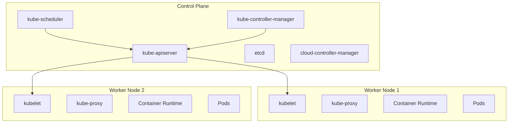

# Kubernetes 완전 가이드

## 목차

1. [Kubernetes 개요](#1-kubernetes-개요)
2. [기본 개념](#2-기본-개념)
3. [Kubernetes 클러스터 설정](#3-kubernetes-클러스터-설정)
4. [워크로드 관리](#4-워크로드-관리)
5. [네트워킹](#5-네트워킹)
6. [스토리지](#6-스토리지)
7. [보안](#7-보안)
8. [모니터링 및 로깅](#8-모니터링-및-로깅)
9. [고급 주제](#9-고급-주제)
10. [실습 예제](#10-실습-예제)
11. [트러블슈팅](#11-트러블슈팅)
12. [참고 자료](#12-참고-자료)

---

## 1. Kubernetes 개요

### 1.1 Kubernetes란?

Kubernetes(k8s)는 컨테이너화된 애플리케이션의 배포, 확장 및 관리를 자동화하는 오픈소스 플랫폼입니다.

**핵심 기능:**
- 자동화된 배포 및 롤백
- 서비스 검색 및 로드 밸런싱
- 스토리지 오케스트레이션
- 자가 치유 (Self-healing)
- 시크릿 및 구성 관리
- 자동 스케일링

### 1.2 Kubernetes의 이점

1. **확장성**: 수평 및 수직 스케일링 지원
2. **가용성**: 장애 복구 및 무중단 서비스
3. **이식성**: 다양한 환경에서 실행 가능
4. **관리성**: 선언적 구성 및 자동화
5. **효율성**: 리소스 최적화 및 비용 절감

### 1.3 Kubernetes 아키텍처



---

## 2. 기본 개념

### 2.1 핵심 오브젝트

#### 2.1.1 Pod

Pod는 Kubernetes의 최소 배포 단위로, 하나 이상의 컨테이너를 포함합니다.

**특징:**
- 동일한 네트워크 및 스토리지 공유
- 함께 스케줄링되고 종료됨
- 고유한 IP 주소 할당

**Pod YAML 예제:**
```yaml
apiVersion: v1
kind: Pod
metadata:
  name: nginx-pod
  labels:
    app: nginx
spec:
  containers:
  - name: nginx
    image: nginx:1.21
    ports:
    - containerPort: 80
```

#### 2.1.2 ReplicaSet

ReplicaSet은 지정된 수의 Pod 복제본이 항상 실행되도록 보장합니다.

```yaml
apiVersion: apps/v1
kind: ReplicaSet
metadata:
  name: nginx-replicaset
spec:
  replicas: 3
  selector:
    matchLabels:
      app: nginx
  template:
    metadata:
      labels:
        app: nginx
    spec:
      containers:
      - name: nginx
        image: nginx:1.21
```

#### 2.1.3 Deployment

Deployment는 ReplicaSet을 관리하며 선언적 업데이트를 제공합니다.

```yaml
apiVersion: apps/v1
kind: Deployment
metadata:
  name: nginx-deployment
spec:
  replicas: 3
  strategy:
    type: RollingUpdate
    rollingUpdate:
      maxUnavailable: 1
      maxSurge: 1
  selector:
    matchLabels:
      app: nginx
  template:
    metadata:
      labels:
        app: nginx
    spec:
      containers:
      - name: nginx
        image: nginx:1.21
        ports:
        - containerPort: 80
        resources:
          requests:
            cpu: 100m
            memory: 128Mi
          limits:
            cpu: 500m
            memory: 256Mi
```

#### 2.1.4 Service

Service는 Pod 집합에 대한 안정적인 네트워크 엔드포인트를 제공합니다.

**Service 타입:**
1. **ClusterIP** (기본값): 클러스터 내부에서만 접근 가능
2. **NodePort**: 각 노드의 특정 포트를 통해 외부 접근 가능
3. **LoadBalancer**: 클라우드 로드 밸런서 생성
4. **ExternalName**: DNS CNAME 레코드 생성

```yaml
apiVersion: v1
kind: Service
metadata:
  name: nginx-service
spec:
  type: ClusterIP
  ports:
  - port: 80
    targetPort: 80
    protocol: TCP
  selector:
    app: nginx
```

#### 2.1.5 ConfigMap과 Secret

**ConfigMap**: 비기밀 구성 데이터 저장
```yaml
apiVersion: v1
kind: ConfigMap
metadata:
  name: app-config
data:
  database.url: "mongodb://localhost:27017"
  log.level: "info"
```

**Secret**: 기밀 데이터 저장 (base64 인코딩)
```yaml
apiVersion: v1
kind: Secret
metadata:
  name: app-secret
type: Opaque
data:
  username: YWRtaW4=  # admin
  password: cGFzc3dvcmQ=  # password
```

#### 2.1.6 Namespace

Namespace는 클러스터 내에서 리소스를 논리적으로 분리합니다.

```yaml
apiVersion: v1
kind: Namespace
metadata:
  name: development
```

---

## 3. Kubernetes 클러스터 설정

### 3.1 클러스터 설정 방법

#### 3.1.1 Minikube (로컬 개발용)

```bash
# Minikube 설치 (macOS)
brew install minikube

# 클러스터 시작
minikube start --driver=docker --memory=4096 --cpus=2

# 클러스터 상태 확인
minikube status

# 대시보드 실행
minikube dashboard
```

#### 3.1.2 kubeadm (온프레미스)

**마스터 노드 초기화:**
```bash
# kubeadm 초기화
sudo kubeadm init --pod-network-cidr=192.168.0.0/16

# kubectl 설정
mkdir -p $HOME/.kube
sudo cp -i /etc/kubernetes/admin.conf $HOME/.kube/config
sudo chown $(id -u):$(id -g) $HOME/.kube/config

# 네트워크 플러그인 설치 (Calico)
kubectl apply -f https://docs.projectcalico.org/manifests/calico.yaml
```

**워커 노드 추가:**
```bash
# 마스터 노드에서 join 토큰 생성
kubeadm token create --print-join-command

# 워커 노드에서 실행
sudo kubeadm join <master-ip>:6443 --token <token> --discovery-token-ca-cert-hash sha256:<hash>
```

#### 3.1.3 관리형 서비스

**AWS EKS:**
```bash
# eksctl 설치
curl --silent --location "https://github.com/weaveworks/eksctl/releases/latest/download/eksctl_$(uname -s)_amd64.tar.gz" | tar xz -C /tmp
sudo mv /tmp/eksctl /usr/local/bin

# EKS 클러스터 생성
eksctl create cluster \
  --name my-cluster \
  --version 1.21 \
  --region us-west-2 \
  --nodegroup-name linux-nodes \
  --node-type m5.large \
  --nodes 3 \
  --nodes-min 1 \
  --nodes-max 4
```

### 3.2 kubectl 설정 및 사용법

#### 3.2.1 기본 명령어

```bash
# 클러스터 정보 확인
kubectl cluster-info

# 노드 목록 조회
kubectl get nodes

# Pod 목록 조회
kubectl get pods
kubectl get pods -o wide
kubectl get pods -n kube-system

# 리소스 상세 정보
kubectl describe pod <pod-name>

# 로그 확인
kubectl logs <pod-name>
kubectl logs -f <pod-name>  # 실시간 로그

# 컨테이너 접속
kubectl exec -it <pod-name> -- /bin/bash

# 포트 포워딩
kubectl port-forward <pod-name> 8080:80
```

#### 3.2.2 YAML 파일 관리

```bash
# 리소스 생성
kubectl apply -f deployment.yaml

# 리소스 업데이트
kubectl apply -f deployment.yaml

# 리소스 삭제
kubectl delete -f deployment.yaml

# dry-run으로 확인
kubectl apply -f deployment.yaml --dry-run=client

# 리소스를 YAML로 출력
kubectl get deployment nginx-deployment -o yaml
```

---

## 4. 워크로드 관리

### 4.1 Deployment 전략

#### 4.1.1 Rolling Update

기본 배포 전략으로, 새 버전을 점진적으로 배포합니다.

```yaml
apiVersion: apps/v1
kind: Deployment
metadata:
  name: app-deployment
spec:
  replicas: 10
  strategy:
    type: RollingUpdate
    rollingUpdate:
      maxUnavailable: 2  # 최대 2개 Pod까지 사용 불가
      maxSurge: 2        # 최대 2개 Pod까지 추가 생성
  selector:
    matchLabels:
      app: myapp
  template:
    metadata:
      labels:
        app: myapp
    spec:
      containers:
      - name: app
        image: myapp:v2
        readinessProbe:
          httpGet:
            path: /health
            port: 8080
          initialDelaySeconds: 5
          periodSeconds: 10
```

#### 4.1.2 Blue-Green Deployment

```bash
# Blue 환경 (현재 프로덕션)
kubectl apply -f blue-deployment.yaml

# Green 환경 (새 버전) 배포
kubectl apply -f green-deployment.yaml

# 트래픽 검증 후 서비스 전환
kubectl patch service myapp-service -p '{"spec":{"selector":{"version":"green"}}}'

# Blue 환경 정리
kubectl delete -f blue-deployment.yaml
```

#### 4.1.3 Canary Deployment

```yaml
# Canary 배포용 Deployment (트래픽의 10%)
apiVersion: apps/v1
kind: Deployment
metadata:
  name: app-canary
spec:
  replicas: 1  # 전체 10개 중 1개
  selector:
    matchLabels:
      app: myapp
      version: canary
  template:
    metadata:
      labels:
        app: myapp
        version: canary
    spec:
      containers:
      - name: app
        image: myapp:v2
---
# 기존 안정 버전 (트래픽의 90%)
apiVersion: apps/v1
kind: Deployment
metadata:
  name: app-stable
spec:
  replicas: 9
  selector:
    matchLabels:
      app: myapp
      version: stable
  template:
    metadata:
      labels:
        app: myapp
        version: stable
    spec:
      containers:
      - name: app
        image: myapp:v1
```

### 4.2 StatefulSet

상태를 가진 애플리케이션을 위한 워크로드입니다.

```yaml
apiVersion: apps/v1
kind: StatefulSet
metadata:
  name: mongodb
spec:
  serviceName: "mongodb"
  replicas: 3
  selector:
    matchLabels:
      app: mongodb
  template:
    metadata:
      labels:
        app: mongodb
    spec:
      containers:
      - name: mongodb
        image: mongo:4.4
        ports:
        - containerPort: 27017
        volumeMounts:
        - name: mongodb-persistent-storage
          mountPath: /data/db
  volumeClaimTemplates:
  - metadata:
      name: mongodb-persistent-storage
    spec:
      accessModes: [ "ReadWriteOnce" ]
      resources:
        requests:
          storage: 10Gi
```

### 4.3 DaemonSet

모든 (또는 일부) 노드에서 Pod를 실행합니다.

```yaml
apiVersion: apps/v1
kind: DaemonSet
metadata:
  name: fluentd
spec:
  selector:
    matchLabels:
      name: fluentd
  template:
    metadata:
      labels:
        name: fluentd
    spec:
      containers:
      - name: fluentd
        image: fluent/fluentd:v1.11
        resources:
          limits:
            memory: 200Mi
          requests:
            cpu: 100m
            memory: 200Mi
        volumeMounts:
        - name: varlog
          mountPath: /var/log
          readOnly: true
      volumes:
      - name: varlog
        hostPath:
          path: /var/log
```

### 4.4 Job과 CronJob

#### 4.4.1 Job (일회성 작업)

```yaml
apiVersion: batch/v1
kind: Job
metadata:
  name: data-migration
spec:
  template:
    spec:
      containers:
      - name: migration
        image: migrate/migrate:v4.15.2
        command: ["migrate", "-path", "/migrations", "-database", "postgres://...", "up"]
      restartPolicy: Never
  backoffLimit: 4  # 최대 재시도 횟수
```

#### 4.4.2 CronJob (스케줄링된 작업)

```yaml
apiVersion: batch/v1
kind: CronJob
metadata:
  name: backup-job
spec:
  schedule: "0 2 * * *"  # 매일 새벽 2시
  jobTemplate:
    spec:
      template:
        spec:
          containers:
          - name: backup
            image: postgres:13
            command:
            - /bin/bash
            - -c
            - pg_dump $DATABASE_URL > /backup/backup-$(date +%Y%m%d).sql
            env:
            - name: DATABASE_URL
              valueFrom:
                secretKeyRef:
                  name: db-secret
                  key: url
            volumeMounts:
            - name: backup-storage
              mountPath: /backup
          volumes:
          - name: backup-storage
            persistentVolumeClaim:
              claimName: backup-pvc
          restartPolicy: OnFailure
```

---

## 5. 네트워킹

### 5.1 Kubernetes 네트워크 모델

Kubernetes는 다음 네트워킹 요구사항을 만족해야 합니다:
- 모든 Pod는 NAT 없이 다른 모든 Pod와 통신 가능
- 모든 노드는 NAT 없이 모든 Pod와 통신 가능
- Pod가 보는 자신의 IP는 다른 Pod가 보는 해당 Pod의 IP와 동일

### 5.2 Service 심화

#### 5.2.1 Headless Service

```yaml
apiVersion: v1
kind: Service
metadata:
  name: mysql-headless
spec:
  clusterIP: None  # Headless Service
  selector:
    app: mysql
  ports:
  - port: 3306
```

#### 5.2.2 ExternalName Service

```yaml
apiVersion: v1
kind: Service
metadata:
  name: external-db
spec:
  type: ExternalName
  externalName: db.example.com
  ports:
  - port: 3306
```

### 5.3 Ingress

HTTP 및 HTTPS 트래픽을 클러스터 내부 서비스로 라우팅합니다.

#### 5.3.1 Ingress Controller 설치

```bash
# NGINX Ingress Controller 설치
kubectl apply -f https://raw.githubusercontent.com/kubernetes/ingress-nginx/controller-v1.1.1/deploy/static/provider/cloud/deploy.yaml
```

#### 5.3.2 Ingress 리소스

```yaml
apiVersion: networking.k8s.io/v1
kind: Ingress
metadata:
  name: app-ingress
  annotations:
    nginx.ingress.kubernetes.io/rewrite-target: /
    nginx.ingress.kubernetes.io/ssl-redirect: "true"
    cert-manager.io/cluster-issuer: "letsencrypt-prod"
spec:
  tls:
  - hosts:
    - myapp.example.com
    secretName: myapp-tls
  rules:
  - host: myapp.example.com
    http:
      paths:
      - path: /api
        pathType: Prefix
        backend:
          service:
            name: api-service
            port:
              number: 80
      - path: /
        pathType: Prefix
        backend:
          service:
            name: frontend-service
            port:
              number: 80
```

### 5.4 NetworkPolicy

Pod 간 네트워크 트래픽을 제어합니다.

```yaml
apiVersion: networking.k8s.io/v1
kind: NetworkPolicy
metadata:
  name: deny-all
  namespace: production
spec:
  podSelector: {}
  policyTypes:
  - Ingress
  - Egress
---
apiVersion: networking.k8s.io/v1
kind: NetworkPolicy
metadata:
  name: allow-api-access
  namespace: production
spec:
  podSelector:
    matchLabels:
      app: api
  policyTypes:
  - Ingress
  ingress:
  - from:
    - podSelector:
        matchLabels:
          app: frontend
    - namespaceSelector:
        matchLabels:
          name: monitoring
    ports:
    - protocol: TCP
      port: 8080
```

---

## 6. 스토리지

### 6.1 Volume

#### 6.1.1 EmptyDir

```yaml
apiVersion: v1
kind: Pod
metadata:
  name: test-pod
spec:
  containers:
  - image: nginx
    name: nginx
    volumeMounts:
    - mountPath: /cache
      name: cache-volume
  volumes:
  - name: cache-volume
    emptyDir: {}
```

#### 6.1.2 HostPath

```yaml
apiVersion: v1
kind: Pod
metadata:
  name: test-pod
spec:
  containers:
  - image: nginx
    name: nginx
    volumeMounts:
    - mountPath: /host-data
      name: host-volume
  volumes:
  - name: host-volume
    hostPath:
      path: /data
      type: Directory
```

### 6.2 PersistentVolume과 PersistentVolumeClaim

#### 6.2.1 PersistentVolume

```yaml
apiVersion: v1
kind: PersistentVolume
metadata:
  name: mysql-pv
spec:
  capacity:
    storage: 20Gi
  accessModes:
    - ReadWriteOnce
  persistentVolumeReclaimPolicy: Retain
  storageClassName: fast-ssd
  hostPath:
    path: /data/mysql
```

#### 6.2.2 PersistentVolumeClaim

```yaml
apiVersion: v1
kind: PersistentVolumeClaim
metadata:
  name: mysql-pvc
spec:
  accessModes:
    - ReadWriteOnce
  resources:
    requests:
      storage: 20Gi
  storageClassName: fast-ssd
```

#### 6.2.3 Pod에서 PVC 사용

```yaml
apiVersion: v1
kind: Pod
metadata:
  name: mysql
spec:
  containers:
  - image: mysql:8.0
    name: mysql
    env:
    - name: MYSQL_ROOT_PASSWORD
      value: "password"
    volumeMounts:
    - mountPath: /var/lib/mysql
      name: mysql-storage
  volumes:
  - name: mysql-storage
    persistentVolumeClaim:
      claimName: mysql-pvc
```

### 6.3 StorageClass

동적 볼륨 프로비저닝을 위한 StorageClass 정의:

```yaml
apiVersion: storage.k8s.io/v1
kind: StorageClass
metadata:
  name: fast-ssd
provisioner: kubernetes.io/aws-ebs
parameters:
  type: gp2
  fsType: ext4
allowVolumeExpansion: true
volumeBindingMode: WaitForFirstConsumer
```

---

## 7. 보안

### 7.1 인증 및 인가

#### 7.1.1 ServiceAccount

```yaml
apiVersion: v1
kind: ServiceAccount
metadata:
  name: my-service-account
  namespace: default
---
apiVersion: v1
kind: Secret
metadata:
  name: my-service-account-token
  annotations:
    kubernetes.io/service-account.name: my-service-account
type: kubernetes.io/service-account-token
```

#### 7.1.2 Role 및 RoleBinding (RBAC)

```yaml
apiVersion: rbac.authorization.k8s.io/v1
kind: Role
metadata:
  namespace: default
  name: pod-reader
rules:
- apiGroups: [""]
  resources: ["pods"]
  verbs: ["get", "watch", "list"]
---
apiVersion: rbac.authorization.k8s.io/v1
kind: RoleBinding
metadata:
  name: read-pods
  namespace: default
subjects:
- kind: ServiceAccount
  name: my-service-account
  namespace: default
roleRef:
  kind: Role
  name: pod-reader
  apiGroup: rbac.authorization.k8s.io
```

#### 7.1.3 ClusterRole 및 ClusterRoleBinding

```yaml
apiVersion: rbac.authorization.k8s.io/v1
kind: ClusterRole
metadata:
  name: secret-reader
rules:
- apiGroups: [""]
  resources: ["secrets"]
  verbs: ["get", "watch", "list"]
---
apiVersion: rbac.authorization.k8s.io/v1
kind: ClusterRoleBinding
metadata:
  name: read-secrets-global
subjects:
- kind: ServiceAccount
  name: secret-reader-sa
  namespace: default
roleRef:
  kind: ClusterRole
  name: secret-reader
  apiGroup: rbac.authorization.k8s.io
```

### 7.2 Pod Security

#### 7.2.1 SecurityContext

```yaml
apiVersion: v1
kind: Pod
metadata:
  name: secure-pod
spec:
  securityContext:
    runAsUser: 1000
    runAsGroup: 3000
    fsGroup: 2000
    seccompProfile:
      type: RuntimeDefault
  containers:
  - name: app
    image: nginx
    securityContext:
      allowPrivilegeEscalation: false
      readOnlyRootFilesystem: true
      capabilities:
        drop:
        - ALL
        add:
        - NET_BIND_SERVICE
    volumeMounts:
    - name: tmp-volume
      mountPath: /tmp
  volumes:
  - name: tmp-volume
    emptyDir: {}
```

#### 7.2.2 PodSecurityPolicy (deprecated) → Pod Security Standards

```yaml
apiVersion: v1
kind: Namespace
metadata:
  name: secure-namespace
  labels:
    pod-security.kubernetes.io/enforce: restricted
    pod-security.kubernetes.io/audit: restricted
    pod-security.kubernetes.io/warn: restricted
```

### 7.3 네트워크 보안

#### 7.3.1 NetworkPolicy 예제

```yaml
apiVersion: networking.k8s.io/v1
kind: NetworkPolicy
metadata:
  name: web-netpol
  namespace: default
spec:
  podSelector:
    matchLabels:
      app: web
  policyTypes:
  - Ingress
  - Egress
  ingress:
  - from:
    - namespaceSelector:
        matchLabels:
          name: frontend
    - podSelector:
        matchLabels:
          app: frontend
    ports:
    - protocol: TCP
      port: 8080
  egress:
  - to:
    - podSelector:
        matchLabels:
          app: database
    ports:
    - protocol: TCP
      port: 5432
```

### 7.4 Secret 관리

#### 7.4.1 Secret 생성 방법

```bash
# 명령어로 생성
kubectl create secret generic db-secret \
  --from-literal=username=admin \
  --from-literal=password=secretpassword

# 파일에서 생성
kubectl create secret generic ssl-certs \
  --from-file=cert.pem \
  --from-file=key.pem

# Docker registry 인증 정보
kubectl create secret docker-registry regcred \
  --docker-server=<registry-server> \
  --docker-username=<username> \
  --docker-password=<password> \
  --docker-email=<email>
```

#### 7.4.2 Secret 사용

```yaml
apiVersion: apps/v1
kind: Deployment
metadata:
  name: app-deployment
spec:
  template:
    spec:
      containers:
      - name: app
        image: myapp:latest
        env:
        - name: DB_USERNAME
          valueFrom:
            secretKeyRef:
              name: db-secret
              key: username
        - name: DB_PASSWORD
          valueFrom:
            secretKeyRef:
              name: db-secret
              key: password
        volumeMounts:
        - name: ssl-certs
          mountPath: /etc/ssl/certs
          readOnly: true
      volumes:
      - name: ssl-certs
        secret:
          secretName: ssl-certs
      imagePullSecrets:
      - name: regcred
```

---

## 8. 모니터링 및 로깅

### 8.1 Prometheus와 Grafana

#### 8.1.1 Prometheus 설치 (Helm 사용)

```bash
# Helm 저장소 추가
helm repo add prometheus-community https://prometheus-community.github.io/helm-charts
helm repo update

# Prometheus 설치
helm install prometheus prometheus-community/kube-prometheus-stack \
  --namespace monitoring \
  --create-namespace \
  --set prometheus.prometheusSpec.retention=30d \
  --set prometheus.prometheusSpec.storageSpec.volumeClaimTemplate.spec.resources.requests.storage=50Gi
```

#### 8.1.2 애플리케이션 메트릭 노출

```yaml
apiVersion: apps/v1
kind: Deployment
metadata:
  name: app-with-metrics
spec:
  template:
    metadata:
      annotations:
        prometheus.io/scrape: "true"
        prometheus.io/port: "8080"
        prometheus.io/path: "/metrics"
    spec:
      containers:
      - name: app
        image: myapp:latest
        ports:
        - containerPort: 8080
          name: metrics
```

#### 8.1.3 ServiceMonitor

```yaml
apiVersion: monitoring.coreos.com/v1
kind: ServiceMonitor
metadata:
  name: app-monitor
  labels:
    app: myapp
spec:
  selector:
    matchLabels:
      app: myapp
  endpoints:
  - port: metrics
    interval: 30s
    path: /metrics
```

### 8.2 로깅

#### 8.2.1 ELK Stack 설정

```yaml
# Elasticsearch
apiVersion: apps/v1
kind: StatefulSet
metadata:
  name: elasticsearch
spec:
  serviceName: elasticsearch
  replicas: 3
  template:
    spec:
      containers:
      - name: elasticsearch
        image: docker.elastic.co/elasticsearch/elasticsearch:7.15.0
        env:
        - name: discovery.type
          value: single-node
        - name: ES_JAVA_OPTS
          value: -Xms1g -Xmx1g
        volumeMounts:
        - name: data
          mountPath: /usr/share/elasticsearch/data
  volumeClaimTemplates:
  - metadata:
      name: data
    spec:
      accessModes: ["ReadWriteOnce"]
      resources:
        requests:
          storage: 10Gi
---
# Fluentd DaemonSet
apiVersion: apps/v1
kind: DaemonSet
metadata:
  name: fluentd
spec:
  template:
    spec:
      containers:
      - name: fluentd
        image: fluent/fluentd-kubernetes-daemonset:v1-debian-elasticsearch
        env:
        - name: FLUENT_ELASTICSEARCH_HOST
          value: elasticsearch.logging.svc.cluster.local
        - name: FLUENT_ELASTICSEARCH_PORT
          value: "9200"
        volumeMounts:
        - name: varlog
          mountPath: /var/log
        - name: varlibdockercontainers
          mountPath: /var/lib/docker/containers
          readOnly: true
      volumes:
      - name: varlog
        hostPath:
          path: /var/log
      - name: varlibdockercontainers
        hostPath:
          path: /var/lib/docker/containers
```

### 8.3 Health Check

#### 8.3.1 Liveness와 Readiness Probe

```yaml
apiVersion: apps/v1
kind: Deployment
metadata:
  name: healthy-app
spec:
  template:
    spec:
      containers:
      - name: app
        image: myapp:latest
        ports:
        - containerPort: 8080
        livenessProbe:
          httpGet:
            path: /health
            port: 8080
          initialDelaySeconds: 30
          periodSeconds: 10
          timeoutSeconds: 5
          failureThreshold: 3
        readinessProbe:
          httpGet:
            path: /ready
            port: 8080
          initialDelaySeconds: 5
          periodSeconds: 5
          timeoutSeconds: 3
          successThreshold: 1
          failureThreshold: 3
        startupProbe:
          httpGet:
            path: /health
            port: 8080
          initialDelaySeconds: 10
          periodSeconds: 10
          timeoutSeconds: 5
          failureThreshold: 30
```

---

## 9. 고급 주제

### 9.1 Horizontal Pod Autoscaler (HPA)

```yaml
apiVersion: autoscaling/v2
kind: HorizontalPodAutoscaler
metadata:
  name: app-hpa
spec:
  scaleTargetRef:
    apiVersion: apps/v1
    kind: Deployment
    name: app-deployment
  minReplicas: 3
  maxReplicas: 100
  metrics:
  - type: Resource
    resource:
      name: cpu
      target:
        type: Utilization
        averageUtilization: 70
  - type: Resource
    resource:
      name: memory
      target:
        type: Utilization
        averageUtilization: 80
  behavior:
    scaleDown:
      stabilizationWindowSeconds: 300
      policies:
      - type: Percent
        value: 10
        periodSeconds: 60
    scaleUp:
      stabilizationWindowSeconds: 0
      policies:
      - type: Percent
        value: 100
        periodSeconds: 15
```

### 9.2 Vertical Pod Autoscaler (VPA)

```yaml
apiVersion: autoscaling.k8s.io/v1
kind: VerticalPodAutoscaler
metadata:
  name: app-vpa
spec:
  targetRef:
    apiVersion: apps/v1
    kind: Deployment
    name: app-deployment
  updatePolicy:
    updateMode: "Auto"  # Off, Initial, Auto
  resourcePolicy:
    containerPolicies:
    - containerName: app
      maxAllowed:
        cpu: 1
        memory: 2Gi
      minAllowed:
        cpu: 100m
        memory: 50Mi
      controlledResources: ["cpu", "memory"]
```

### 9.3 Cluster Autoscaler

```yaml
apiVersion: apps/v1
kind: Deployment
metadata:
  name: cluster-autoscaler
  namespace: kube-system
spec:
  template:
    spec:
      containers:
      - image: k8s.gcr.io/autoscaling/cluster-autoscaler:v1.21.0
        name: cluster-autoscaler
        command:
        - ./cluster-autoscaler
        - --v=4
        - --stderrthreshold=info
        - --cloud-provider=aws
        - --skip-nodes-with-local-storage=false
        - --expander=least-waste
        - --node-group-auto-discovery=asg:tag=k8s.io/cluster-autoscaler/enabled,k8s.io/cluster-autoscaler/my-cluster
        - --balance-similar-node-groups
        - --scale-down-delay-after-add=10m
        - --scale-down-unneeded-time=10m
```

### 9.4 Custom Resource Definitions (CRD)

```yaml
apiVersion: apiextensions.k8s.io/v1
kind: CustomResourceDefinition
metadata:
  name: applications.stable.example.com
spec:
  group: stable.example.com
  versions:
  - name: v1
    served: true
    storage: true
    schema:
      openAPIV3Schema:
        type: object
        properties:
          spec:
            type: object
            properties:
              name:
                type: string
              version:
                type: string
              replicas:
                type: integer
                minimum: 1
                maximum: 10
          status:
            type: object
            properties:
              phase:
                type: string
  scope: Namespaced
  names:
    plural: applications
    singular: application
    kind: Application
```

### 9.5 Operators

Operator는 CRD와 Controller를 결합하여 복잡한 애플리케이션을 관리합니다.

```bash
# Operator SDK 설치
curl -LO https://github.com/operator-framework/operator-sdk/releases/download/v1.21.0/operator-sdk_linux_amd64
chmod +x operator-sdk_linux_amd64
sudo mv operator-sdk_linux_amd64 /usr/local/bin/operator-sdk

# 새 Operator 프로젝트 생성
operator-sdk init --domain example.com --repo github.com/example/app-operator

# API 추가
operator-sdk create api --group cache --version v1alpha1 --kind Memcached --resource --controller
```

---

## 10. 실습 예제

### 10.1 마이크로서비스 애플리케이션 배포

#### 10.1.1 Frontend 서비스

```yaml
apiVersion: apps/v1
kind: Deployment
metadata:
  name: frontend
spec:
  replicas: 3
  selector:
    matchLabels:
      app: frontend
  template:
    metadata:
      labels:
        app: frontend
    spec:
      containers:
      - name: frontend
        image: nginx:alpine
        ports:
        - containerPort: 80
        resources:
          requests:
            cpu: 100m
            memory: 128Mi
          limits:
            cpu: 500m
            memory: 256Mi
---
apiVersion: v1
kind: Service
metadata:
  name: frontend-service
spec:
  selector:
    app: frontend
  ports:
  - port: 80
    targetPort: 80
  type: LoadBalancer
```

#### 10.1.2 Backend API 서비스

```yaml
apiVersion: apps/v1
kind: Deployment
metadata:
  name: backend-api
spec:
  replicas: 5
  selector:
    matchLabels:
      app: backend-api
  template:
    metadata:
      labels:
        app: backend-api
    spec:
      containers:
      - name: api
        image: node:16-alpine
        command: ["node", "server.js"]
        ports:
        - containerPort: 3000
        env:
        - name: DATABASE_URL
          valueFrom:
            secretKeyRef:
              name: db-secret
              key: url
        - name: REDIS_URL
          valueFrom:
            configMapKeyRef:
              name: cache-config
              key: redis-url
        livenessProbe:
          httpGet:
            path: /health
            port: 3000
          initialDelaySeconds: 30
          periodSeconds: 10
        readinessProbe:
          httpGet:
            path: /ready
            port: 3000
          initialDelaySeconds: 5
          periodSeconds: 5
        resources:
          requests:
            cpu: 200m
            memory: 256Mi
          limits:
            cpu: 1
            memory: 512Mi
---
apiVersion: v1
kind: Service
metadata:
  name: backend-api-service
spec:
  selector:
    app: backend-api
  ports:
  - port: 80
    targetPort: 3000
```

#### 10.1.3 데이터베이스 (PostgreSQL)

```yaml
apiVersion: apps/v1
kind: StatefulSet
metadata:
  name: postgres
spec:
  serviceName: postgres
  replicas: 1
  selector:
    matchLabels:
      app: postgres
  template:
    metadata:
      labels:
        app: postgres
    spec:
      containers:
      - name: postgres
        image: postgres:13
        ports:
        - containerPort: 5432
        env:
        - name: POSTGRES_DB
          value: myapp
        - name: POSTGRES_USER
          valueFrom:
            secretKeyRef:
              name: postgres-secret
              key: username
        - name: POSTGRES_PASSWORD
          valueFrom:
            secretKeyRef:
              name: postgres-secret
              key: password
        volumeMounts:
        - name: postgres-storage
          mountPath: /var/lib/postgresql/data
        resources:
          requests:
            cpu: 500m
            memory: 1Gi
          limits:
            cpu: 1
            memory: 2Gi
  volumeClaimTemplates:
  - metadata:
      name: postgres-storage
    spec:
      accessModes: ["ReadWriteOnce"]
      resources:
        requests:
          storage: 20Gi
---
apiVersion: v1
kind: Service
metadata:
  name: postgres-service
spec:
  selector:
    app: postgres
  ports:
  - port: 5432
    targetPort: 5432
  clusterIP: None  # Headless service
```

#### 10.1.4 Redis 캐시

```yaml
apiVersion: apps/v1
kind: Deployment
metadata:
  name: redis
spec:
  replicas: 1
  selector:
    matchLabels:
      app: redis
  template:
    metadata:
      labels:
        app: redis
    spec:
      containers:
      - name: redis
        image: redis:6-alpine
        ports:
        - containerPort: 6379
        resources:
          requests:
            cpu: 100m
            memory: 128Mi
          limits:
            cpu: 500m
            memory: 256Mi
        volumeMounts:
        - name: redis-storage
          mountPath: /data
      volumes:
      - name: redis-storage
        emptyDir: {}
---
apiVersion: v1
kind: Service
metadata:
  name: redis-service
spec:
  selector:
    app: redis
  ports:
  - port: 6379
    targetPort: 6379
```

### 10.2 CI/CD 파이프라인

#### 10.2.1 GitLab CI 예제

```yaml
# .gitlab-ci.yml
stages:
  - build
  - test
  - deploy

variables:
  DOCKER_IMAGE: $CI_REGISTRY_IMAGE:$CI_COMMIT_SHA
  KUBECONFIG_FILE: $KUBECONFIG

build:
  stage: build
  script:
    - docker build -t $DOCKER_IMAGE .
    - docker push $DOCKER_IMAGE

test:
  stage: test
  script:
    - kubectl apply -f k8s/test/ --dry-run=client
    - helm lint charts/myapp

deploy:
  stage: deploy
  script:
    - kubectl set image deployment/app app=$DOCKER_IMAGE
    - kubectl rollout status deployment/app
  only:
    - main
```

#### 10.2.2 GitHub Actions 예제

```yaml
# .github/workflows/deploy.yml
name: Deploy to Kubernetes

on:
  push:
    branches: [main]

jobs:
  deploy:
    runs-on: ubuntu-latest
    steps:
    - uses: actions/checkout@v2
    
    - name: Setup kubectl
      uses: azure/setup-kubectl@v1
      with:
        version: 'v1.21.0'
    
    - name: Set up kubeconfig
      run: |
        mkdir -p ~/.kube
        echo "${{ secrets.KUBECONFIG }}" | base64 -d > ~/.kube/config
    
    - name: Deploy to cluster
      run: |
        kubectl apply -f k8s/
        kubectl set image deployment/app app=${{ github.sha }}
        kubectl rollout status deployment/app
```

---

## 11. 트러블슈팅

### 11.1 일반적인 문제들

#### 11.1.1 Pod가 Pending 상태

```bash
# Pod 상태 확인
kubectl get pods
kubectl describe pod <pod-name>

# 노드 리소스 확인
kubectl top nodes
kubectl describe nodes

# 이벤트 확인
kubectl get events --sort-by=.metadata.creationTimestamp
```

**해결 방법:**
- 리소스 부족: 노드 추가 또는 리소스 요청 줄이기
- PVC 문제: StorageClass 확인, PV 생성
- Node selector/affinity 문제: 라벨 확인

#### 11.1.2 Pod가 CrashLoopBackOff

```bash
# 로그 확인
kubectl logs <pod-name> --previous
kubectl logs <pod-name> -c <container-name>

# Pod 상세 정보
kubectl describe pod <pod-name>
```

**해결 방법:**
- 애플리케이션 오류 수정
- 환경변수, ConfigMap, Secret 확인
- 이미지 태그 확인
- 리소스 제한 조정

#### 11.1.3 Service 연결 문제

```bash
# Service 확인
kubectl get svc
kubectl describe svc <service-name>

# Endpoints 확인
kubectl get endpoints <service-name>

# DNS 테스트
kubectl run test-pod --image=busybox --rm -it -- nslookup <service-name>
```

### 11.2 네트워크 문제 해결

```bash
# 네트워크 연결 테스트
kubectl run netshoot --image=nicolaka/netshoot --rm -it -- bash

# 내부에서:
# ping <pod-ip>
# telnet <service-name> <port>
# dig <service-name>.<namespace>.svc.cluster.local

# NetworkPolicy 확인
kubectl get networkpolicies
kubectl describe networkpolicy <policy-name>
```

### 11.3 성능 문제

#### 11.3.1 리소스 사용량 모니터링

```bash
# 노드 리소스 사용량
kubectl top nodes

# Pod 리소스 사용량
kubectl top pods
kubectl top pods --all-namespaces

# 특정 Pod 리소스 사용량
kubectl top pod <pod-name> --containers
```

#### 11.3.2 HPA 문제

```bash
# HPA 상태 확인
kubectl get hpa
kubectl describe hpa <hpa-name>

# Metrics Server 확인
kubectl get pods -n kube-system | grep metrics-server
kubectl logs -n kube-system deployment/metrics-server
```

### 11.4 디버깅 도구

#### 11.4.1 kubectl debug

```bash
# 임시 디버깅 컨테이너 생성
kubectl debug <pod-name> -it --image=busybox

# 노드에서 디버깅
kubectl debug node/<node-name> -it --image=busybox
```

#### 11.4.2 유용한 명령어

```bash
# 모든 리소스 조회
kubectl get all

# 특정 라벨로 필터링
kubectl get pods -l app=nginx

# JSON 경로로 특정 필드 추출
kubectl get pods -o jsonpath='{.items[*].metadata.name}'

# 롤아웃 기록 조회
kubectl rollout history deployment/<deployment-name>

# 롤백
kubectl rollout undo deployment/<deployment-name>

# 스케일링
kubectl scale deployment/<deployment-name> --replicas=5

# 포트 포워딩
kubectl port-forward svc/<service-name> 8080:80
```

---

## 12. 참고 자료

### 12.1 공식 문서
- [Kubernetes 공식 문서](https://kubernetes.io/docs/)
- [kubectl 치트시트](https://kubernetes.io/docs/reference/kubectl/cheatsheet/)
- [API 레퍼런스](https://kubernetes.io/docs/reference/kubernetes-api/)

### 12.2 도구 및 에코시스템
- [Helm](https://helm.sh/) - Kubernetes 패키지 매니저
- [Kustomize](https://kustomize.io/) - 구성 커스터마이징 도구
- [Istio](https://istio.io/) - 서비스 메시
- [Prometheus](https://prometheus.io/) - 모니터링 및 알림
- [Grafana](https://grafana.com/) - 시각화 및 분석

### 12.3 학습 자료
- [Kubernetes The Hard Way](https://github.com/kelseyhightower/kubernetes-the-hard-way)
- [CNCF 트레이닝](https://www.cncf.io/certification/training/)
- [Kubernetes 패턴](https://k8spatterns.io/)

### 12.4 커뮤니티
- [Kubernetes Slack](https://slack.k8s.io/)
- [CNCF](https://www.cncf.io/)
- [KubeCon](https://events.linuxfoundation.org/kubecon-cloudnativecon-north-america/)

### 12.5 자격증
- **CKA** (Certified Kubernetes Administrator)
- **CKAD** (Certified Kubernetes Application Developer)
- **CKS** (Certified Kubernetes Security Specialist)

---

## 부록

### A. 자주 사용하는 kubectl 명령어

```bash
# 기본 조회
kubectl get pods
kubectl get pods -o wide
kubectl get pods -w  # watch mode

# 상세 정보
kubectl describe pod <pod-name>
kubectl describe node <node-name>

# 로그 조회
kubectl logs <pod-name>
kubectl logs -f <pod-name>  # follow
kubectl logs <pod-name> --since=1h

# 실행 및 접속
kubectl exec -it <pod-name> -- /bin/bash
kubectl exec <pod-name> -- ls /

# 파일 복사
kubectl cp <pod-name>:/path/to/file /local/path
kubectl cp /local/path <pod-name>:/path/to/file

# 포트 포워딩
kubectl port-forward pod/<pod-name> 8080:80
kubectl port-forward svc/<service-name> 8080:80

# 리소스 편집
kubectl edit pod <pod-name>
kubectl edit deployment <deployment-name>

# 라벨 관리
kubectl label pods <pod-name> env=production
kubectl label pods <pod-name> env-  # 라벨 제거

# 어노테이션 관리
kubectl annotate pods <pod-name> description="web server"
kubectl annotate pods <pod-name> description-  # 어노테이션 제거
```

### B. YAML 파일 템플릿

#### B.1 Deployment 템플릿

```yaml
apiVersion: apps/v1
kind: Deployment
metadata:
  name: <deployment-name>
  namespace: <namespace>
  labels:
    app: <app-name>
spec:
  replicas: <replica-count>
  strategy:
    type: RollingUpdate
    rollingUpdate:
      maxUnavailable: 1
      maxSurge: 1
  selector:
    matchLabels:
      app: <app-name>
  template:
    metadata:
      labels:
        app: <app-name>
        version: <version>
    spec:
      containers:
      - name: <container-name>
        image: <image>:<tag>
        ports:
        - containerPort: <port>
        env:
        - name: <env-var-name>
          value: <env-var-value>
        resources:
          requests:
            cpu: <cpu-request>
            memory: <memory-request>
          limits:
            cpu: <cpu-limit>
            memory: <memory-limit>
        livenessProbe:
          httpGet:
            path: <health-path>
            port: <port>
          initialDelaySeconds: 30
          periodSeconds: 10
        readinessProbe:
          httpGet:
            path: <ready-path>
            port: <port>
          initialDelaySeconds: 5
          periodSeconds: 5
```

### C. 성능 튜닝 가이드

#### C.1 리소스 최적화

1. **CPU 및 메모리 요청/제한 설정**
   - 요청: 스케줄링을 위한 최소 리소스
   - 제한: 컨테이너가 사용할 수 있는 최대 리소스

2. **Quality of Service (QoS) 클래스**
   - **Guaranteed**: requests = limits
   - **Burstable**: requests < limits
   - **BestEffort**: requests와 limits 미설정

3. **노드 어피니티 및 Pod 어피니티**
   ```yaml
   spec:
     affinity:
       nodeAffinity:
         requiredDuringSchedulingIgnoredDuringExecution:
           nodeSelectorTerms:
           - matchExpressions:
             - key: node-type
               operator: In
               values: ["high-memory"]
   ```

### D. 보안 체크리스트

- [ ] RBAC 활성화 및 최소 권한 원칙 적용
- [ ] NetworkPolicy로 네트워크 트래픽 제한
- [ ] Pod Security Standards 적용
- [ ] Secret를 환경변수가 아닌 볼륨으로 마운트
- [ ] 컨테이너를 root 사용자로 실행하지 않기
- [ ] 읽기 전용 루트 파일시스템 사용
- [ ] 불필요한 Linux 기능(capabilities) 제거
- [ ] 정기적인 이미지 스캔
- [ ] Admission Controller 설정
- [ ] 감사 로깅 활성화

---

이 매뉴얼은 Kubernetes의 기본 개념부터 고급 주제까지 포괄적으로 다룹니다. 실습을 통해 각 개념을 익히고, 프로덕션 환경에서의 모범 사례를 따르시기 바랍니다.